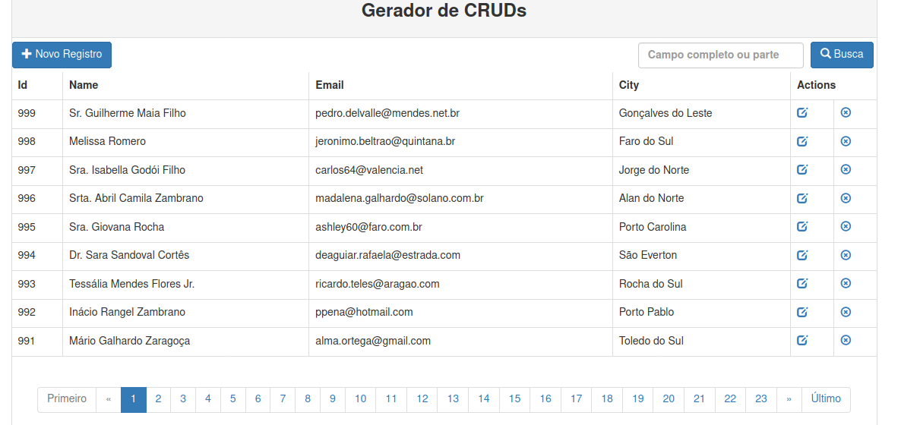

# Gerador de CRUDs em PHP

Eu tinha um crud-generator, que é para Laravel. Se estiver procurando por este ele fica em

https://github.com/ribafs/laravel-crud-generator

## Recursos

- PHP estruturado
- PDO
- Bootstrap 3
- Paginação com Bootpag
- Busca
- Funções úteis
- Boa prática
- Tabela do MySQL com dados de teste gerada pela biblioteca Faker:
    - https://github.com/ribafs/faker-dados
    - https://github.com/ribafs/FakerRestaurantBr
    - https://github.com/fzaninotto/Faker

## Requisitos:
- Apache2
- PHP 5.5.9+
- MySQL 5.5+ ou PostgreSQL 8+

## SGBD testados

- MySQL
- PostgreSQL

## Esta fase

Esta é a fase inicial deste gerador. Ele tem 4 fases, esta que é em PHP estruturado. A próxima que é em PHPOO. A seguinte usa MVC e a final que usa MVC com classes estáticas. A intenção aqui é mostrar a conversão de um aplicativo em PHP estruturado para PHPOO. Depois converter PHPOO para MVC simples e finalmente converter o aplicativo com MVC para MVC com classes estáticas, como gostam de usar os grandes frameworks.

## Instalação

Somente no primeiro acesso será mostrado o form de instalação.

- Download de https://github.com/ribafs/auto-crud
- Descompacte para seu diretório web na pasta gerador (exemplo0
- Crie um banco dedados no MySQL
- Acesse

http://localhost/gerador

Entre com oa dados no form

## MySQL

## PostgreSQL

Então será levado para o CRUD com PDO, Bootstrap, Paginação e Busca, com suporte a MySQL e PostgreSQL garantidos e ainda outros via PDO populado com os registros da tabela indicada.

Pode e idealmente deve testar com os scripts existentes para mysql e para postgresql: db_my.sql e db_pg.sql.

## Customizações

O código com a paginação está basicamente no arquivo index.php ao final. É uma paginação com o plugin da jQuery Bootpag (https://botmonster.com/jquery-bootpag/). A lib está em assets/js.

A customização pode ser feita no arquivo index.php

## Objetivo principal

O principal objetivo deste pequeno software é o de facilitar a vida de quem não programa e nem está pensando em aprender e quer apenas criar algo rápido, como uma agenda ou um cadastro simples.

## Referências

- https://www.kodingmadesimple.com/2017/01/simple-ajax-pagination-in-jquery-php-pdo-mysql.html
- https://www.codingcage.com/2015/10/create-pagination-script-using-php-jquery.html
- https://www.bipmedia.com/blog/tutorial/pagination-script-using-php-pdo-with-jquery

## Licença

MIT

