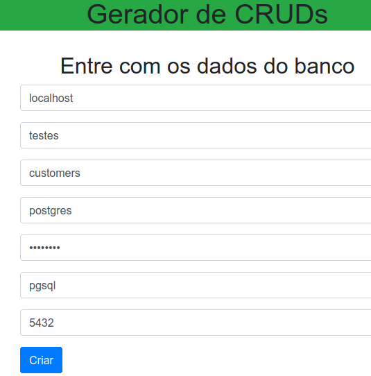
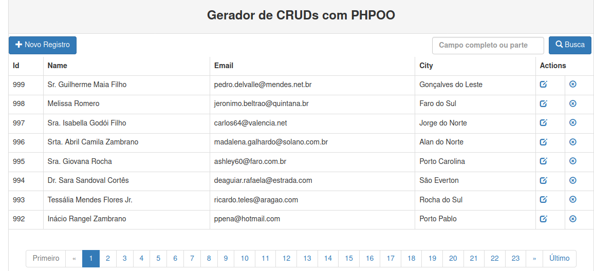

# Gerador de CRUDs em PHP

##  Alerta
São 4 exemplos com a intenção também de mostrar as mudanças de estruturado para OO, mas o objetivo principal é o de oferecer um CRUD rápido para a manipulação das operações sobre os registros de uma tabela. Nada além disso. Caso queira algo com bons padrões de projeto e boas práticas sugiro procurar um bom framework, como o Laravel. Inclusive para este recomendo um bom gerador de CRUDs:

https://github.com/ribafs/laravel-crud-generator

Caso precise de algo com ACL use:

https://github.com/ribafs/laravel-acl

Veja a transformação de um aplicativo em PHP estruturado para um aplicativo em PHPOO.

Recomenda-se que crie um banco no MySQL ou no PostgreSQL e importe um dos scripts.
Então faça o download deste repositório para seu diretório web. Então abra um dos dois CRUDs.

- [1crud-generator-php](1crud-generator-php)
- [2crud-generator-phpoo](2crud-generator-phpoo)

## Formulário inicial

Chame o index de um dos diretórios (php ou phpoo), que aparecerá:

Depois que preencher e enviar receberá o CRUD completo:

Você pode escolher um dos 2 tipos para usar ou pode iniciar com o primeiro e experimentar os 2.
